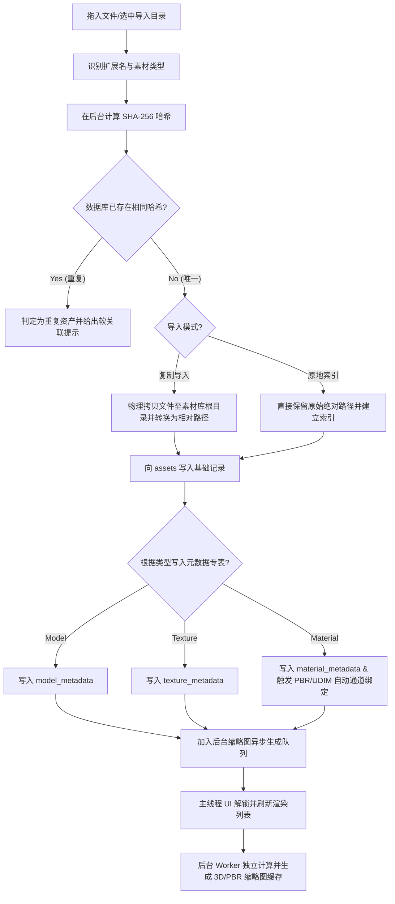

# AssetVault — 专业 3D 素材与材质资产中枢设计文档

> **定位说明**：本文档用于描述 AssetVault 的长期产品定位、系统架构、技术路线和版本演进，不作为 v0.1 唯一开发任务清单。

> 项目代号：AssetVault  
> 文档版本：v1.0 (黄金重组版)  
> 阶段：产品与技术设计阶段  
> 日期：2026-05-25  
> 定位关键词：本地优先、材质工作流、多 DCC Connector、PBR/UDIM、3D 资产管理、专业生产管线

---

## 一、项目概述

### 1.1 产品定位

AssetVault 是一款面向专业 3D 创作者与团队的 **3D 素材与材质资产中枢**。它不仅用于管理模型、贴图、HDRI 等文件，也用于统一组织 PBR 材质包、UDIM 贴图组、程序化材质、IES 灯光、Brush、LUT、DCC 工程资产与引擎资产，并通过标准化 Connector 架构与主流 3D 软件、材质软件、实时引擎和渲染器生态连接。

AssetVault 的目标不是做一个普通文件浏览器，而是成为 3D 生产管线中的资产入口：
- **统一管理资产**：集中式/索引式管理本地、外接硬盘和 NAS 中的所有 3D 数字资产。
- **快速搜索与筛选**：SQLite FTS5 全文检索 + 标签多维筛选 + 动态表达式索引。
- **实时预览**：免打开 DCC，实时预览 3D 模型、材质球、高清贴图和 HDRI 环境图。
- **自动识别通道**：自动匹配 PBR 材质贴图通道与 UDIM tile 贴图组。
- **DCC 一键推送**：通过 WebSocket 长连接将资产一键推送到 Blender、Maya、Unreal 等创作端。
- **Export Profile**：同一套资产一键导出为适配不同 DCC、引擎和渲染器规范的格式。

### 1.2 产品核心定位一句话
> AssetVault 是一个本地优先、以材质与 3D 资产管理为核心、具备多 DCC / 材质软件 / 引擎 Connector 架构的专业 3D 资产中枢。

### 1.3 核心价值
| 创作者痛点 | AssetVault 解决方案 |
| :--- | :--- |
| 素材散落在硬盘、NAS、项目目录中 | 统一素材库 + 路径相对索引 + 标签/分类/集合 |
| 找不到需要的模型、材质、贴图 | SQLite FTS5 全文搜索 + 多维筛选 + 智能集合 |
| 素材内容不直观，必须打开软件才知道 | 3D 预览、材质球预览、贴图预览、HDRI 预览、自动缩略图 |
| PBR 贴图组命名混乱 | 自动识别 Albedo / Normal / Roughness / Metallic / AO / Height 等贴图通道 |
| UDIM 贴图难管理 | UDIM tile 自动识别与成组管理 |
| 导入 DCC 软件步骤繁琐 | Connector 一键推送到 DCC、材质软件或引擎 |
| 不同软件材质格式不统一 | Export Profile + 材质通道映射 + 渲染器 profile |
| 资产重复、版本混乱 | SHA-256 哈希去重 + 版本管理 + 关联关系 |
| 团队共享素材容易冲突 | 本地 SQLite + Sidecar `.meta.json` 监控同步机制 |

### 1.4 产品边界与 v0.1 MVP 范围
为了在首版（v0.1）快速验证产品核心价值，AssetVault 采取**克制但不降级定位**的剪裁策略：
- **不做创作工具**：不替代 Blender、Maya、Substance Painter 或 Unreal 等引擎本身的创作功能。
- **砍去大部分 DCC 插件与联动**：**v0.1 L3 深度 Connector 仅实现 Blender；Substance Painter 在 v0.1 提供 L1 管理级与 L2 导出/监听级支持（包括管理 `.sbsar`、`.sbs`、`.spp` 文件，识别 Substance 导出的贴图组，PBR 通道自动归组，支持 Substance Painter 导出目录监听，以及支持把贴图组导出为 Blender/Unreal/Unity profile），L3 插件级支持后置**。Maya/Max/UE/Unity 等其他 DCC 插件全部后置至 v2.0/v3.0 版本。
- **剥离 Rust 侧编译依赖**：v0.1 彻底移除 Rust 后端对 C++ `assimp-sys` 的编译依赖，规避跨平台打包难题。gltf/glb 采用纯 Rust 深度解析，OBJ/STL 采用纯 Rust 基础解析，FBX/USD/Alembic 及原生 DCC 格式仅进行文件管理（大小/哈希），不解析，预览降级。
- **推迟高级特性**：第一阶段不做插件系统 (WASM 沙箱)、复杂多版本控制、格式转换、智能集合等。

### 1.5 版本演进策略

#### v0.1 — 本地专业素材库 + Blender L3 Connector
- 本地素材库、标签、分类、搜索、回收站
- 模型、贴图、HDRI、PBR 材质基础管理
- PBR 贴图通道自动识别
- UDIM 命名识别与成组管理
- Three.js 模型/材质球/HDRI 预览
- Blender L3 深度 Connector
- Substance Painter L1/L2 级支持：文件管理、导出目录监听、贴图组识别
- Export Profile 基础框架

#### v0.2 — 材质工作流增强
- Substance Painter L3 Connector
- Unreal / Unity Export Profile
- ORM / Mask Map 通道打包
- MaterialX / USDShade 初步支持
- 材质批量重命名与通道修复

#### v1.0 — 多软件生产管线版
- Maya / 3ds Max / C4D / Houdini Connector
- Unreal / Unity 插件
- NAS Sidecar 团队协作
- 插件系统与脚本自动化
- 渲染器 profile：Arnold / V-Ray / Redshift / Octane / Corona

### 1.6 功能优先级矩阵

| 优先级 | 功能模块与特性描述 |
| :--- | :--- |
| **Must Have** (核心必做) | 资产物理导入/原地索引、SQLite FTS5 全文搜索、标签管理、自定义目录分类、3D 缩略图后台生成与虚拟滚动列表、标准 3D 模型/材质球/HDRI 前端 WebGL 预览、Blender L3 深度 Connector 一键推送 |
| **Should Have** (高价值应做) | PBR 材质贴图通道自动识别/关联物理映射、UDIM tile 自动成组与网格化预览、Substance Painter 导出目录监听（L2 支持）及贴图包归组 |
| **Could Have** (低优先级可选) | 导出配置（Export Profile）参数配置 UI、HDRI 高级 360 度交互与曝光控制、IES 灯光/LUT 元数据解析与预览 |
| **Won’t Have in v0.1** (首版暂不包含) | Maya/Max/UE/Unity 插件、WASM 插件沙箱市场、NAS 共享多端 Sidecar 协作（Sidecar 增量写入）、云端备份与团队素材库同步 |

---

## 二、 核心产品模块

### 2.1 Asset Library 素材库
负责本地素材导入、复制、相对路径重建、哈希去重、分类、标签、搜索和回收站管理。
- **导入模式**：支持“复制到素材库目录”或“仅原地建立索引”双模式。
- **文件去重**：导入时计算文件 SHA-256 哈希，检测重复文件，避免存储浪费。
- **回收站（软删除）**：删除文件默认移入回收站，记录原始路径，支持 30 天自动清理与一键还原，提供文件物理丢失检测。

#### 2.1.1 资产导入流程图 (Import Pipeline)



### 2.2 Material Hub 材质中心
AssetVault 的差异化核心，负责管理 PBR 材质、贴图组、程序化材质、UDIM 和 HDRI。
- **PBR 贴图通道自动识别**：根据文件名后缀自动匹配通道：
  - *Albedo/BaseColor*: albedo, basecolor, base_color, diffuse, diff, color
  - *Normal*: normal, nor, nrm
  - *Roughness*: roughness, rough, rgh
  - *Metallic*: metallic, metalness, metal
  - *AO*: ao, ambient_occlusion, occlusion
  - *Height/Displacement*: height, displacement, disp
  - *Opacity/Alpha*: opacity, alpha, transparent
  - *Emissive*: emissive, emission, glow
- **材质预览**：PBR 材质在前端渲染器中通过标准 PBR 材质球实时预览；HDRI 环境贴图支持 360 度全景球预览；UDIM 支持 tile 网格化预览。

### 2.3 Connector Hub 连接器中心
连接前端 3D 创作软件和材质生产工具的桥梁。所有软件插件均通过标准的能力声明接入：
- **注册机制**：DCC 插件（如 Blender 插件）在启动并连接本地 WebSocket 服务后，发送 JSON 注册包声明自己的导入能力。
- **声明示例**：
  ```json
  {
    "connectorId": "blender",
    "displayName": "Blender",
    "type": "dcc",
    "version": "4.1.0",
    "capabilities": {
      "importModel": true,
      "importTextureSet": true,
      "importMaterial": true,
      "applyMaterialToSelection": true,
      "importHdri": true,
      "watchExportFolder": false,
      "supportsUdim": false
    }
  }
  ```
- **架构解耦**：主程序仅读取 `capabilities` 开启或禁用相应操作，避免为每个软件硬编码特定的业务逻辑。

### 2.4 Export Profile 导出配置
管理不同 DCC、渲染器和引擎对材质贴图打包的通道映射。例如：
- **Blender PBR**：导出为分离通道贴图，Principled BSDF 节点材质。
- **Unreal Packed ORM**：自动将 Occlusion (红通道)、Roughness (绿通道)、Metallic (蓝通道) 打包成单张 ORM 贴图，适配引擎规范。
- **Unity URP**：导出为 Metallic (RGB) + Smoothness (A) 复合通道贴图。

---

## 三、 技术架构

### 3.1 技术栈选型
| 层级 | 技术 | 说明 |
| :--- | :--- | :--- |
| **框架** | Tauri 2 | 跨平台桌面框架，包体积小 10x，内存占用低 3x |
| **前端** | Vue 3 + TypeScript | 组合式 API + 类型安全，开发效率高 |
| **状态管理** | Pinia | 轻量响应式状态管理 |
| **UI 组件** | Naive UI | 原生支持优秀的暗黑主题定制，Tree 与虚拟列表性能极佳 |
| **3D 渲染** | Three.js r170+ | WebGL 模型、PBR 材质球、HDRI 预览及离屏截图渲染 |
| **后端** | Rust | 高性能文件处理、多线程队列、元数据提取与本地 API 服务 |
| **数据库** | SQLite (rusqlite) | 本地嵌入式，零配置，支持 FTS5 全文搜索与 JSON1 |
| **缩略图** | Rust image + Three.js 离屏 | 混合方案：图片由 Rust 后端生成，3D/材质球由 WebGL 离屏渲染截图 |
| **DCC 通信** | actix-web + actix-ws | 本地 HTTP/WebSocket 服务（127.0.0.1，Token 强制鉴权） |

### 3.2 进程模型
```text
主进程 Rust
├── Tauri Core              窗口管理、Tauri IPC
├── Database Service        SQLite 连接池、迁移（Migrations）、写入事务
├── Import Worker           后台素材导入队列（不卡 UI）
├── File Watcher            本地与 NAS 共享目录变化监控（PollWatcher）
└── Connector Server        本地 HTTP/WebSocket 安全服务端 (127.0.0.1:17532)

渲染进程 WebView
├── Vue App                 主操作界面
├── Pinia Stores            状态同步（Asset, Tag, Connector, UI）
├── Three.js Runtime        3D 模型、材质球预览及离屏截图
└── Web Workers             前端轻量运算（如贴图后缀匹配）
```

---

## 四、 性能设计与指标

### 4.1 性能优化策略
- **大文件加载**：注册 Tauri 自定义协议 `assetvault://`，绕过本地环回网络栈，实现流式大模型加载，无 Base64 转换与网络拷贝开销。
- **流式分块读取**：自定义协议处理器支持 HTTP `Range` 头解析，返回 `206 Partial Content`，供大文件预览使用。
- **渲染器资源回收**：Three.js 场景关闭时主动调用 `dispose()` 释放几何体、材质与纹理，避免显存泄露。
- **按需加载与虚拟滚动**：素材网格视图使用虚拟列表滚动，按需从本地磁盘缓存中加载缩略图。

### 4.2 性能验收指标 (Performance Metrics)
| 测试场景 | 验收硬性指标 | 备注说明 |
| :--- | :--- | :--- |
| **大库冷启动** | 10 万级素材冷启动时间 <= 3.0 秒 | 仅预加载素材路径与前 100 张缩略图，不加载整库数据到内存 |
| **全文检索响应** | 10 万级素材下任意关键词检索响应 <= 200 毫秒 | 充分利用 SQLite FTS5 的倒排索引与虚拟表优化 |
| **分类/属性筛选** | 10 万级素材任意复合属性筛选 <= 50 毫秒 | 充分利用自定义字段的 SQLite 表达式索引（JSON1） |
| **网格列表滚动** | 纵向极速滚动下平均帧率稳定在 50fps+ | 依靠 Vue 虚拟列表与本地磁盘缩略图 LRU 缓存机制 |
| **批量资产导入** | 5 秒内 UI 解锁并进入后台队列 | SHA-256 哈希计算、元数据深度解析与完整缩略图生成允许在后台异步队列完成（优先处理可见区域的缩略图生成），不阻塞主线程和用户操作 |

### 4.3 首版 (v0.1) 验收标准 (Acceptance Criteria)

| 验收维度 | 验收硬性指标与测试用例 |
| :--- | :--- |
| **批量文件导入** | 选中 1000 个素材拖入，5 秒内 UI 解锁并恢复可操作状态，剩余元数据提取与缩略图在后台异步队列完成。 |
| **全文检索响应** | 在拥有 10 万条资产记录的库中，输入关键词，FTS5 全文搜索返回第一页耗时 <= 200 毫秒。 |
| **Blender 插件联动** | 插件在 Blender 4.0+ 成功安装，通过 WebSocket 握手成功；能够一键搜索/下载/加载库内 GLB/OBJ 格式模型，并能自动把 PBR 贴图组应用至选中的 Principled BSDF 材质节点。 |
| **PBR/UDIM 自动识别** | 导入标准的 PBR 贴图包（含 Albedo/Normal/Roughness 后缀）识别成功率 >= 90%；UDIM 贴图包自动根据 1001-1008 网格规整化显示。 |
| **数据安全与健壮性** | 执行物理删除文件进入回收站，可完美恢复至原路径；关闭程序时数据库完整性无损；如果 schema Migrations 迁移崩溃，能回滚至备份数据库。 |
| **大模型预览加载** | 500MB 超大模型加载前展示精确加载进度，超过 1GB 模型给出超限降级提示 | 防止显存爆溢导致 WebGL 崩溃 |

---

## 五、 数据库设计

### 5.1 核心实体 ER 拓扑
```text
assets (素材主表)
├── model_metadata (1:1 模型元数据)
├── texture_metadata (1:1 贴图元数据)
├── material_metadata (1:1 材质元数据)
├── material_maps (材质与贴图通道关联)
│    └── texture_sets (贴图组)
├── asset_tags (素材-标签多对多)
├── asset_categories (素材-分类多对多)
├── collection_assets (素材-集合关联)
└── asset_versions (素材版本)

tags (标签库)
categories (分类树)
collections (集合表)
export_profiles (导出预设)
software_connectors (连接器表)
```

### 5.2 完整表结构定义

#### assets（素材主表）
```sql
CREATE TABLE assets (
    id                    TEXT PRIMARY KEY,          -- UUID v7
    name                  TEXT NOT NULL,             -- 显示名称
    file_path             TEXT NOT NULL,             -- 库内相对路径
    original_path         TEXT,                      -- 原始物理路径
    file_hash             TEXT NOT NULL,             -- SHA-256
    file_size             INTEGER NOT NULL,          -- 字节数
    asset_type            TEXT NOT NULL,             -- model/material/texture/hdri/ies/brush/lut/other
    format                TEXT NOT NULL,             -- gltf/fbx/obj/png/hdr 等
    thumbnail_path        TEXT,                      -- 缩略图相对路径
    description           TEXT DEFAULT '',
    author                TEXT DEFAULT '',
    source                TEXT DEFAULT '',           -- 来源（商店名/网站）
    license               TEXT DEFAULT '',           -- 许可证
    color_label           TEXT DEFAULT '',           -- 颜色标记 red/yellow/green/blue/purple
    rating                INTEGER DEFAULT 0,         -- 评分 0-5
    is_favorite           BOOLEAN DEFAULT FALSE,     -- 是否收藏
    current_version       INTEGER DEFAULT 1,         -- 当前版本号
    import_date           TEXT NOT NULL,             -- 导入时间 ISO8601
    update_date           TEXT NOT NULL,             -- 更新时间
    last_used_date        TEXT,                      -- 最后使用时间
    use_count             INTEGER DEFAULT 0,         -- 使用次数
    metadata_json         TEXT DEFAULT '{}',         -- 动态自定义属性 (JSON)
    -- 软删除与状态管理（回收站支持）
    is_deleted            BOOLEAN DEFAULT FALSE,     -- 是否已移入回收站
    deleted_at            TEXT,                      -- 回收站删除时间
    deleted_original_path TEXT,                      -- 原绝对路径，用于还原
    status                TEXT DEFAULT 'active',     -- 状态：active/archived/deleted/missing
    created_at            TEXT NOT NULL DEFAULT (datetime('now')),
    updated_at            TEXT NOT NULL DEFAULT (datetime('now'))
);

CREATE INDEX idx_assets_type ON assets(asset_type);
CREATE INDEX idx_assets_format ON assets(format);
CREATE INDEX idx_assets_hash ON assets(file_hash);
CREATE INDEX idx_assets_name ON assets(name);
CREATE INDEX idx_assets_date ON assets(import_date);
CREATE INDEX idx_assets_favorite ON assets(is_favorite);
CREATE INDEX idx_assets_deleted ON assets(is_deleted);
CREATE INDEX idx_assets_status ON assets(status);
CREATE INDEX idx_assets_type_deleted ON assets(asset_type, is_deleted);
```

#### model_metadata（模型元数据专表）
```sql
CREATE TABLE model_metadata (
    asset_id        TEXT PRIMARY KEY REFERENCES assets(id) ON DELETE CASCADE,
    vertex_count    INTEGER,                   -- 顶点数
    face_count      INTEGER,                   -- 面数
    triangle_count  INTEGER,                   -- 三角面数
    has_skeleton    BOOLEAN DEFAULT FALSE,     -- 是否包含骨骼
    has_animation   BOOLEAN DEFAULT FALSE,     -- 是否包含动画
    animation_count INTEGER DEFAULT 0,
    material_count  INTEGER DEFAULT 0,
    mesh_count      INTEGER DEFAULT 0,
    bounding_min_x  REAL,                      -- 物理尺寸包围盒
    bounding_min_y  REAL,
    bounding_min_z  REAL,
    bounding_max_x  REAL,
    bounding_max_y  REAL,
    bounding_max_z  REAL,
    dimension_x     REAL,                      -- 实际长宽高
    dimension_y     REAL,
    dimension_z     REAL,
    unit_scale      REAL DEFAULT 1.0,
    lod_count       INTEGER DEFAULT 1,
    uv_channels     INTEGER DEFAULT 1
);
```

#### texture_metadata（贴图元数据专表）
```sql
CREATE TABLE texture_metadata (
    asset_id        TEXT PRIMARY KEY REFERENCES assets(id) ON DELETE CASCADE,
    width           INTEGER NOT NULL,
    height          INTEGER NOT NULL,
    channels        INTEGER DEFAULT 4,         -- 通道数
    bit_depth       INTEGER DEFAULT 8,         -- 位深度
    color_space     TEXT DEFAULT 'auto',       -- sRGB/Linear/Raw
    texture_type    TEXT DEFAULT 'unknown',    -- albedo/normal/roughness/metallic...
    is_hdr          BOOLEAN DEFAULT FALSE,
    is_tiled        BOOLEAN DEFAULT FALSE,
    is_udim         BOOLEAN DEFAULT FALSE,
    udim_tile       TEXT,
    has_alpha       BOOLEAN DEFAULT FALSE
);
```

#### material_metadata（材质元数据专表）
```sql
CREATE TABLE material_metadata (
    asset_id            TEXT PRIMARY KEY REFERENCES assets(id) ON DELETE CASCADE,
    material_type       TEXT DEFAULT 'pbr',      -- pbr/procedural/toon/custom
    workflow            TEXT DEFAULT 'metallic_roughness',
    texture_count       INTEGER DEFAULT 0,
    supports_udim       BOOLEAN DEFAULT FALSE,
    has_albedo          BOOLEAN DEFAULT FALSE,
    has_normal          BOOLEAN DEFAULT FALSE,
    has_roughness       BOOLEAN DEFAULT FALSE,
    has_metallic        BOOLEAN DEFAULT FALSE,
    has_ao              BOOLEAN DEFAULT FALSE,
    has_emissive        BOOLEAN DEFAULT FALSE,
    has_opacity         BOOLEAN DEFAULT FALSE,
    has_height          BOOLEAN DEFAULT FALSE,
    renderer_profile    TEXT DEFAULT ''
);
```

#### texture_sets（贴图组定义）
```sql
CREATE TABLE texture_sets (
    id              TEXT PRIMARY KEY,
    name            TEXT NOT NULL,
    root_path       TEXT,
    material_asset_id TEXT REFERENCES assets(id) ON DELETE SET NULL,
    workflow        TEXT DEFAULT 'metallic_roughness',
    is_udim         BOOLEAN DEFAULT FALSE,
    resolution_x    INTEGER,
    resolution_y    INTEGER,
    created_at      TEXT NOT NULL DEFAULT (datetime('now')),
    updated_at      TEXT NOT NULL DEFAULT (datetime('now'))
);
CREATE INDEX idx_texture_sets_material ON texture_sets(material_asset_id);
```

#### material_maps（材质通道物理映射表）
```sql
CREATE TABLE material_maps (
    id                TEXT PRIMARY KEY,
    material_asset_id TEXT NOT NULL REFERENCES assets(id) ON DELETE CASCADE,
    texture_set_id    TEXT REFERENCES texture_sets(id) ON DELETE SET NULL,
    map_type          TEXT NOT NULL,            -- albedo/normal/roughness/metallic/ao/height/emissive
    texture_asset_id  TEXT REFERENCES assets(id) ON DELETE SET NULL,
    file_path         TEXT,                     -- 贴图物理相对路径
    color_space       TEXT DEFAULT 'auto',
    udim_tile         TEXT,
    resolution_x      INTEGER,
    resolution_y      INTEGER
);
CREATE INDEX idx_material_maps_material ON material_maps(material_asset_id);
CREATE INDEX idx_material_maps_type ON material_maps(map_type);
CREATE UNIQUE INDEX idx_material_maps_unique_channel
ON material_maps(material_asset_id, map_type, IFNULL(udim_tile, ''));
```

#### software_connectors（软件连接器注册表）
```sql
CREATE TABLE software_connectors (
    id                  TEXT PRIMARY KEY,          -- 例如: blender, maya
    name                TEXT NOT NULL,
    software_type       TEXT NOT NULL,             -- dcc/material_authoring/engine/renderer
    executable_path     TEXT,
    plugin_installed    BOOLEAN DEFAULT FALSE,
    connection_status   TEXT DEFAULT 'offline',    -- online/offline
    version             TEXT,
    capabilities_json   TEXT DEFAULT '{}',         -- JSON能力配置
    auth_token_alias    TEXT,
    last_connected_at   TEXT,
    created_at          TEXT NOT NULL DEFAULT (datetime('now')),
    updated_at          TEXT NOT NULL DEFAULT (datetime('now'))
);
CREATE INDEX idx_software_connectors_status ON software_connectors(connection_status);
```

#### export_profiles（导出通道预设表）
```sql
CREATE TABLE export_profiles (
    id              TEXT PRIMARY KEY,
    name            TEXT NOT NULL,
    target_software TEXT NOT NULL,             -- blender/unreal/unity/arnold...
    asset_type      TEXT NOT NULL,             -- model/material/texture_set
    format          TEXT NOT NULL,
    preset_json     TEXT DEFAULT '{}',         -- 映射通道规则配置
    is_default      BOOLEAN DEFAULT FALSE,
    created_at      TEXT NOT NULL DEFAULT (datetime('now')),
    updated_at      TEXT NOT NULL DEFAULT (datetime('now'))
);
CREATE INDEX idx_export_profiles_target ON export_profiles(target_software, asset_type);
```

#### categories（树形分类表）与 tags（标签表）
```sql
CREATE TABLE categories (
    id          TEXT PRIMARY KEY,
    name        TEXT NOT NULL,
    parent_id   TEXT REFERENCES categories(id) ON DELETE SET NULL,
    icon        TEXT DEFAULT '',
    sort_order  INTEGER DEFAULT 0,
    asset_type  TEXT DEFAULT '',
    created_at  TEXT NOT NULL DEFAULT (datetime('now'))
);

CREATE TABLE tags (
    id          TEXT PRIMARY KEY,
    name        TEXT NOT NULL UNIQUE,
    color       TEXT DEFAULT '#666666',
    usage_count INTEGER DEFAULT 0,
    created_at  TEXT NOT NULL DEFAULT (datetime('now'))
);

CREATE TABLE asset_tags (
    asset_id    TEXT NOT NULL REFERENCES assets(id) ON DELETE CASCADE,
    tag_id      TEXT NOT NULL REFERENCES tags(id) ON DELETE CASCADE,
    PRIMARY KEY (asset_id, tag_id)
);
```

### 5.3 FTS5 全文搜索设计与 Triggers 同步脚本

#### FTS5 虚拟表定义
```sql
CREATE VIRTUAL TABLE assets_fts USING fts5(
    name,
    description,
    author,
    source,
    tags_virtual,                              -- 虚拟列：存放关联标签拼接字符串
    content='assets',
    content_rowid='rowid'
);
```

#### 自动同步 SQLite 触发器
```sql
-- 1. 新增资产时自动添加全文搜索索引
CREATE TRIGGER tbl_assets_ai AFTER INSERT ON assets BEGIN
  INSERT INTO assets_fts(rowid, name, description, author, source, tags_virtual)
  VALUES (new.rowid, new.name, new.description, new.author, new.source, '');
END;

-- 2. 删除资产时自动同步清理全文索引
CREATE TRIGGER tbl_assets_ad AFTER DELETE ON assets BEGIN
  INSERT INTO assets_fts(assets_fts, rowid, name, description, author, source, tags_virtual)
  VALUES('delete', old.rowid, old.name, old.description, old.author, old.source, '');
END;

-- 3. 修改资产基础信息时自动重构全文索引
CREATE TRIGGER tbl_assets_au AFTER UPDATE ON assets BEGIN
  INSERT INTO assets_fts(assets_fts, rowid, name, description, author, source, tags_virtual)
  VALUES('delete', old.rowid, old.name, old.description, old.author, old.source, 
         (SELECT group_concat(t.name, ' ') FROM tags t JOIN asset_tags at ON t.id = at.tag_id WHERE at.asset_id = old.id));
  
  INSERT INTO assets_fts(rowid, name, description, author, source, tags_virtual)
  VALUES (new.rowid, new.name, new.description, new.author, new.source, 
          (SELECT group_concat(t.name, ' ') FROM tags t JOIN asset_tags at ON t.id = at.tag_id WHERE at.asset_id = new.id));
END;

-- 4. 关联标签增加时，刷新对应的 tags_virtual 列
CREATE TRIGGER tbl_asset_tags_ai AFTER INSERT ON asset_tags BEGIN
  UPDATE assets_fts 
  SET tags_virtual = (SELECT group_concat(t.name, ' ') FROM tags t JOIN asset_tags at ON t.id = at.tag_id WHERE at.asset_id = new.asset_id)
  WHERE rowid = (SELECT rowid FROM assets WHERE id = new.asset_id);
END;

-- 5. 关联标签删除时，刷新对应的 tags_virtual 列
CREATE TRIGGER tbl_asset_tags_ad AFTER DELETE ON asset_tags BEGIN
  UPDATE assets_fts 
  SET tags_virtual = (SELECT group_concat(t.name, ' ') FROM tags t JOIN asset_tags at ON t.id = at.tag_id WHERE at.asset_id = old.asset_id)
  WHERE rowid = (SELECT rowid FROM assets WHERE id = old.asset_id);
END;

-- 6. 标签库标签重命名时，重构所有涉及资产的 FTS 索引
CREATE TRIGGER tbl_tags_au AFTER UPDATE OF name ON tags BEGIN
  UPDATE assets_fts
  SET tags_virtual = (
    SELECT group_concat(t.name, ' ') 
    FROM tags t 
    JOIN asset_tags at ON t.id = at.tag_id 
    WHERE at.asset_id = (SELECT id FROM assets WHERE rowid = assets_fts.rowid)
  )
  WHERE rowid IN (
    SELECT a.rowid 
    FROM assets a 
    JOIN asset_tags at ON a.id = at.asset_id 
    WHERE at.tag_id = new.id
  );
END;
```

### 5.4 JSON1 表达式索引 (Expression Indexes)
```sql
-- 数值索引：加速多边形面数的高频过滤与排序
CREATE INDEX idx_assets_json_face 
ON assets(CAST(json_extract(metadata_json, '$.face_count') AS INTEGER)) 
WHERE json_extract(metadata_json, '$.face_count') IS NOT NULL;

-- 布尔索引：加速骨骼绑定快速过滤
CREATE INDEX idx_assets_json_has_rig 
ON assets(json_extract(metadata_json, '$.has_rig')) 
WHERE json_extract(metadata_json, '$.has_rig') IS NOT NULL;
```

---

## 六、 本地 API 与 WebSocket 安全协议

### 6.1 安全规范
- **监听限制**：服务严格绑定至 `127.0.0.1` 环回接口，**禁止**绑定到 `0.0.0.0`，防范外部物理局域网恶意访问。
- **Token 鉴权逻辑**：
  - 核心/危险写接口（如 `POST /api/v1/assets/import`，以及获取文件真实路径 `GET /api/v1/assets/:id/file`）：执行强 Token 鉴权（通过请求头 `Authorization: Bearer <token>` 验证）。
  - 低权限只读接口（如获取标签列表）：允许使用低权限只读 Token 访问。
  - Token 存在本地用户的安全目录中，并在主程序启动时动态生成和配给。
- **WebSocket 跨端与无 Origin 鉴权策略**：
  - 对带 Origin 头的请求（如前端 WebView 渲染进程发起的连接）：执行白名单校验，仅允许 `tauri://localhost` 或 `tauri.localhost`。
  - 对不带 Origin 头的请求（如 Blender、Maya 等本地 Python 插件发起的 TCP/WebSocket 连接）：放宽 Origin 白名单限制，但必须进行强 Token 验证（支持将 Token 放入 Query 参数或通过 `Sec-WebSocket-Protocol` 子协议头传输，如未携带或校验失败则一律拒绝连接）。
  - *安全提示*：文档所附示例代码仅表达鉴权的大体流程。在生产环境中，后端必须使用标准 Query Parser（例如 Rust 中的 `url::Url` 或 `serde_urlencoded`）精确解析出 `token` 字段进行全等比较，**严禁**使用字符串 `contains` 进行模糊判断，以防止通过构造诸如 `?dummy=token=xxxx` 等恶意参数绕过鉴权。

### 6.2 WebSocket 双向推送 API
- **连接地址**：`ws://127.0.0.1:17532/api/v1/ws?token=<token>`
- **DCC 插件连接注册 (DCC -> Tauri)**：
  ```json
  {
    "event": "register",
    "data": {
      "connectorId": "blender",
      "displayName": "Blender",
      "type": "dcc",
      "version": "4.1.0",
      "pid": 5824,
      "capabilities": {
        "importModel": true,
        "importMaterial": true,
        "applyMaterialToSelection": true,
        "importHdri": true
      }
    }
  }
  ```
- **一键推送模型导入 (Tauri -> DCC)**：
  ```json
  {
    "event": "import_asset",
    "data": {
      "id": "01HXYZ...",
      "name": "Sci-fi Soldier",
      "assetType": "model",
      "format": "glb",
      "filePath": "C:/AssetLibrary/Models/soldier.glb",
      "metadata": {
        "vertexCount": 12500,
        "faceCount": 8200
      }
    }
  }
  ```

---

## 七、 软件支持策略与支持格式清单

### 7.1 L1/L2/L3 支持原则
- **L1 管理级**：能够导入、哈希去重、分类、标记和全文搜索。
- **L2 工作流导出级**：支持通过 `Export Profile` 导出特定规范的文件。
- **L3 深度 Connector 级**：支持在 DCC 内部通过长连接直接调用、双向数据通信（v0.1 首发仅实现 Blender L3 级别支持）。

### 7.2 模型支持格式清单 (v0.1)
| 格式 | 扩展名 | v0.1 管理 | v0.1 预览 | v0.1 解析 | 说明 |
| :--- | :--- | :---: | :---: | :---: | :--- |
| **glTF 2.0** | `.gltf` / `.glb` | ✅ | ✅ Three.js | ✅ Rust gltf | 官方推荐主格式，提供深度元数据解析 |
| **OBJ** | `.obj` | ✅ | ✅ Three.js | ✅ Rust obj-rs | 纯 Rust 几何面数解析，规避 assimp 依赖 |
| **STL** | `.stl` | ✅ | ✅ Three.js | ✅ Rust stl_io | 纯 Rust 几何面数解析，规避 assimp 依赖 |
| **FBX** | `.fbx` | ✅ | ✅ Three.js | ⚠️ 仅基础属性 | 前端 WebGL 渲染；Rust 端仅读取文件哈希/大小，规避 assimp-sys 强编译依赖 |
| **USD** | `.usd` / `.usda` / `.usdc` / `.usdz` | ✅ | ❌ | ❌ | v0.1 仅做文件物理管理，不解析 |
| **Alembic** | `.abc` | ✅ | ❌ | ❌ | v0.1 仅做文件物理管理，不解析 |
| **Blend** | `.blend` | ✅ | ❌ | ❌ | Blender 原生文件，支持外部应用打开 |

### 7.3 材质与贴图/其他格式支持清单 (v0.1)
| 类型 | 格式 | v0.1 管理 | v0.1 预览 | v0.1 解析 | 说明 |
| :--- | :--- | :---: | :---: | :---: | :--- |
| **PBR 贴图** | `PNG`/`JPG`/`TIF`/`TGA` | ✅ | ✅ | ✅ | 读取尺寸、位深、通道数及色彩空间等 |
| **HDRI** | `HDR`/`EXR` | ✅ | ✅ | ⚠️ | HDRI 全景球 360 度预览，Rust 基础属性读取 |
| **UDIM** | `1001`/`1002` 命名贴图 | ✅ | ✅ | ✅ | 自动识别多 tile 并归组为单个贴图集 |
| **Substance 材质** | `SBSAR`/`SBS` | ✅ | ⚠️ | ❌ | v0.1 仅管理与封面图提取预览，L3 解析后置 |
| **Photoshop 源文件** | `PSD` | ✅ | ⚠️ | ❌ | 基础封面预览，合并图层预览后置 |
| **IES 灯光** | `IES` | ✅ | ❌ | ⚠️ | 基础配光曲线元数据解析 |
| **LUT** | `CUBE`/`3DL` | ✅ | ❌ | ⚠️ | 调色资源元数据与通道参数管理 |

---

## 八、 项目开发规范、UI 风格与系统维护方案

### 8.1 代码与分支规范
- **静态检查**：Rust 使用 `rustfmt` + `clippy` 联合卡关；TS 使用 `ESLint` + `Prettier`；写操作禁止 `any` 并必须进行完整强类型声明。
- **Git Commit 格式**：基于 Angular Commit 规范，格式为 `<type>(<scope>): <subject>`，如 `feat(importer): add fbx metadata extractor`。

### 8.2 UI 视觉美学与微交互
- **配色主格**：**极客暗黑玻璃态 (Sleek Dark Glassmorphism)**。窗口主背景色为 `#0F0F11` (玄武黑)，卡片容器底色 `#18181C` (浅炭灰)，强调高亮采用 `#6366F1` (赛博靛蓝)，结合 `backdrop-filter: blur(12px)` 的模糊边缘。
- **排版字体**：数字和面数元数据必须使用等宽字体 `JetBrains Mono` 或 `Fira Code`，保证视觉对齐。
- **拖拽文件交互**：文件拖入窗口时，激活霓虹蓝 `#6366F1` 虚线呼吸动画边框。
- **卡片悬浮动效**：Hover 时卡片向上偏移 `4px`，渐隐边框产生轻微发光（Glow Effect），快捷动作组浮现。

### 8.3 系统维护保障方案
- **自动化构建 (CI/CD)**：通过 GitHub Actions 执行平台构建，集成 Windows `.msi` 签名证书与 macOS 苹果开发者 ID Notarization 公证流程。
- **本地滚动日志与 Panic 捕获**：引入 Rust `tracing-appender` 实现本地滚动日志审计（保存 7 天，文件上限 10MB）。拦截 Rust `std::panic` 并导出 Panic Dump 文件到指定崩溃路径。
- **数据库先备份后升级**：在 SQLite 执行 schema Migrations 升级前，自动拷贝 `assets.db` 重命名备份。若迁移失败自动实施回滚，防止数据损坏。
- **DCC 插件自热更新**：WebSocket 注册时验证协议版本（Protocol Handshake），如版本过旧，主程序自动从本地静态包或远程拉取最新 DCC 插件 `.zip` 覆盖写入至 DCC 的 addon 目录。**所有 DCC 插件更新包必须带版本号、SHA-256 校验值与 Ed25519/RSA 签名。主程序验证签名通过后才允许覆盖安装，禁止执行未签名插件包。**
- **物理素材库免损坏移动**：数据库路径记录统一基于根目录的“相对路径”。用户迁移素材盘至新硬盘时，仅需在客户端重定位“素材库根目录”即可零成本完成物理重建。

---

## 九、 核心技术落地实现细则

### 9.1 Tauri 2 自定义协议支持大文件流式传输 (HTTP Range)
```rust
use std::fs::File;
use std::io::{Read, Seek, SeekFrom};
use tauri::http::{Request, Response, ResponseBuilder, header};

pub fn handle_asset_request(request: &Request) -> Result<Response<Vec<u8>>, Box<dyn std::error::Error>> {
    let uri = request.uri().path();
    let safe_path = sanitize_uri_path(uri)?; // 过滤目录穿越

    let mut file = File::open(&safe_path)?;
    let metadata = file.metadata()?;
    let file_len = metadata.len();

    let range_header = request.headers().get("range");
    let mut builder = ResponseBuilder::new();

    if let Some(range_val) = range_header.and_then(|r| r.to_str().ok()) {
        if let Some((start, end)) = parse_range_header(range_val, file_len) {
            let part_len = end - start + 1;
            let mut buffer = vec![0u8; part_len as usize];
            
            file.seek(SeekFrom::Start(start))?;
            file.read_exact(&mut buffer)?;

            return builder
                .status(206)
                .header(header::CONTENT_RANGE, format!("bytes {}-{}/{}", start, end, file_len))
                .header(header::CONTENT_LENGTH, part_len)
                .header(header::CONTENT_TYPE, get_mime_type(&safe_path))
                .body(buffer)
                .map_err(Into::into);
        }
    }

    let mut buffer = Vec::new();
    file.read_to_end(&mut buffer)?;
    builder
        .status(200)
        .header(header::CONTENT_LENGTH, file_len)
        .header(header::CONTENT_TYPE, get_mime_type(&safe_path))
        .body(buffer)
        .map_err(Into::into)
}
```

> [!WARNING]
> **超大文件安全拦截**：为防止客户端在加载超大文件（例如 > 500MB 模型）时，因未携带 `Range` 头而导致 Rust 端执行 `read_to_end` 一次性将整个文件读入内存造成 OOM。正式实现时必须检测文件大小，对超出阈值且未携带 `Range` 的请求主动返回 `416 Range Not Satisfiable` 提示客户端使用分块加载，或者改用分块流（Streaming Body）机制输出。

### 9.2 Three.js 离屏渲染生成 3D 缩略图
```typescript
import * as THREE from 'three';

export async function generateThumbnail(modelData: ArrayBuffer, width = 512, height = 512): Promise<string> {
  const scene = new THREE.Scene();
  // ... 初始化离屏场景（配置光照、摄像机、载入缓冲模型） ...

  const renderer = new THREE.WebGLRenderer({ antialias: true, alpha: true });
  renderer.setSize(width, height);

  const renderTarget = new THREE.WebGLRenderTarget(width, height);
  renderer.setRenderTarget(renderTarget);
  renderer.render(scene, camera);
  
  const buffer = new Uint8Array(width * height * 4);
  renderer.readRenderTargetPixels(renderTarget, 0, 0, width, height, buffer);
  
  const canvas2d = document.createElement('canvas');
  canvas2d.width = width;
  canvas2d.height = height;
  const ctx = canvas2d.getContext('2d')!;
  
  const imgData = ctx.createImageData(width, height);
  // WebGL 纹理坐标 (Y-up) 与 Canvas2D 坐标 (Y-down) 进行翻转物理映射
  for (let y = 0; y < height; y++) {
    const srcRow = (height - 1 - y) * width * 4;
    const destRow = y * width * 4;
    imgData.data.set(buffer.subarray(srcRow, srcRow + width * 4), destRow);
  }
  ctx.putImageData(imgData, 0, 0);

  renderTarget.dispose();
  renderer.dispose();

  return canvas2d.toDataURL('image/png');
}
```

### 9.3 局域网/NAS 目录文件变化监控与防抖 (PollWatcher)
```rust
use notify::{Config, PollWatcher, RecursiveMode, Watcher};
use std::time::Duration;
use std::sync::mpsc::channel;

pub fn start_network_folder_watcher(nas_path: &str) -> Result<(), Box<dyn std::error::Error>> {
    let (tx, rx) = channel();
    let config = Config::default().with_poll_interval(Duration::from_secs(5)); // 每 5 秒主动轮询一次

    let mut watcher = PollWatcher::new(tx, config)?;
    watcher.watch(nas_path.as_ref(), RecursiveMode::Recursive)?;

    std::thread::spawn(move || {
        while let Ok(event) = rx.recv() {
            if let Ok(evt) = event {
                // 防抖检查：大文件写入占坑检查，确信文件写入完毕后才刷新本地 SQLite 元数据
                if is_file_writing_finished(&evt.paths[0]) {
                    process_sidecar_change(&evt.paths[0]);
                }
            }
        }
    });
    Ok(())
}

fn is_file_writing_finished(path: &std::path::Path) -> bool {
    std::fs::OpenOptions::new().write(true).open(path).is_ok()
}
```

### 9.4 本地 WebSocket 双向安全通信接口 (actix-ws)
```rust
use actix_web::{web, App, HttpRequest, HttpResponse, HttpServer, Responder, Error};
use actix_ws::Message;

async fn ws_handler(
    req: HttpRequest,
    body: web::Payload,
    server_token: web::Data<String>
) -> Result<impl Responder, Error> {
    // 1. 跨站连接劫持 (CSWJH) 严格防护：存在 Origin 时进行白名单校验
    // （Blender/Maya 等本地 Python 客户端连接通常不带 Origin，放行但执行强 Token 校验）
    if let Some(origin) = req.headers().get("origin") {
        let origin_str = origin.to_str().unwrap_or("");
        if origin_str != "tauri://localhost" && !origin_str.ends_with("tauri.localhost") {
            return Ok(HttpResponse::Forbidden().body("Invalid Origin"));
        }
    }

    // 2. Token 安全鉴权（支持 Query 参数或 Sec-WebSocket-Protocol 子协议头验证）
    let query: std::collections::HashMap<String, String> =
        serde_urlencoded::from_str(req.query_string()).unwrap_or_default();

    let query_token = query.get("token").map(|s| s.as_str());

    let protocol_token = req
        .headers()
        .get("Sec-WebSocket-Protocol")
        .and_then(|v| v.to_str().ok());

    let token_valid =
        query_token == Some(server_token.as_str()) ||
        protocol_token == Some(server_token.as_str());
        
    if !token_valid {
        return Ok(HttpResponse::Unauthorized().body("Unauthorized Token"));
    }

    let (response, mut session, mut msg_stream) = actix_ws::handle(&req, body)?;

    actix_web::rt::spawn(async move {
        while let Some(Ok(msg)) = msg_stream.recv().await {
            match msg {
                Message::Text(text) => {
                    // 执行来自 DCC 长连接推送的命令
                    println!("DCC Cmd: {}", text);
                }
                Message::Ping(bytes) => {
                    let _ = session.pong(&bytes).await;
                }
                _ => break,
            }
        }
        let _ = session.close(None).await;
    });

    Ok(response)
}
```

> [!CAUTION]
> **强安全解析验证**：上面代码已采用 `serde_urlencoded` 精确解析 Query 参数。实际项目中必须保持 token 全等比较，不允许退回 `contains()`、正则模糊匹配或字符串拼接判断，防范利用子参数构造攻击绕过鉴权。
