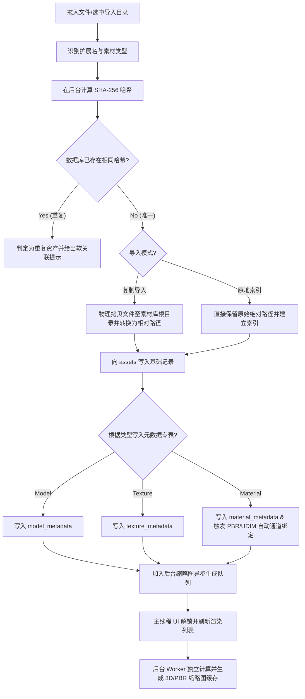

# AssetVault v0.1 MVP 开发技术规格白皮书

> **职责声明**：本文档是 v0.1 研发落地标准，所有 v0.1 开发、联调、测试和验收以本文档为准。

> **阶段**：v0.1 研发落地规范  
> **文档版本**：v1.0 (研发专版)  
> **日期**：2026-05-25  
> **定位**：本地优先专业 3D 素材库 + Blender L3 深度联动 + Substance Painter L1/L2 贴图监听  
> **目标**：提供给研发团队快速拆分任务、开发排期、接口联调与验收的唯一技术标准。

---

## 一、 v0.1 产品功能边界

v0.1 版本遵循**极简收敛、单点突破**原则，功能范围规定如下：

### 1.1 核心支持模块
- **本地素材库 (Asset Library)**：
  - 本地文件拖拽导入，支持“复制到库”与“原地索引”双模式。
  - 基于 SHA-256 哈希计算的自动物理去重。
  - 回收站功能（软删除），记录原路径并支持 30 天自动清理与还原。
- **材质管理中枢 (Material Hub)**：
  - PBR 贴图文件后缀自动识别与通道绑定。
  - UDIM 命名规则自动识别与网格规整化成组。
  - 缩略图后台队列生成，前端 WebGL (Three.js) 离屏截图。
- **连接器中心 (Connector Hub)**：
  - **Blender (L3 级)**：Blender 插件一键安装、长连接握手、素材/材质一键推送及自动节点组装应用。
  - **Substance Painter (L1/L2 级)**：支持 `.sbsar`、`.sbs`、`.spp` 等格式的管理；支持监听 Substance Painter 导出文件夹，当贴图导出时，自动触发 AssetVault 贴图归组与导入刷新。
- **导出预设 (Export Profile)**：
  - 首版提供内置静态 JSON 配置，支持将贴图包以指定通道配置映射（如 Blender PBR 节点规范）一键导出。

### 1.2 优先级矩阵 (v0.1 Focus)

| 优先级 | 功能模块 | 开发约束 |
| :--- | :--- | :--- |
| **Must Have** | 资产导入/哈希去重/软删除、FTS5 全文检索、Blender 插件 WebSocket 通信、Three.js 离屏缩略图及模型/材质预览 | 首版的核心链路，必须通过自动化与人工集成测试 |
| **Should Have** | PBR 通道自动识别、UDIM 分组识别、Substance Painter 目录监听与文件归组 | 凸显材质中枢特性的功能，需处理好边界异常 |
| **Won't Have** | Maya/Max/UE/Unity 插件、WASM 插件沙箱、NAS 团队多端协作（Sidecar 增量写入）、云端同步 | 全面后置至 v0.2/v1.0，v0.1 严禁过度设计 |

---

## 二、 v0.1 资产导入业务流 (Import Pipeline)



### 导入时性能安全设计
1. **后台 Worker 线程**：哈希计算与文件 IO 拷贝必须放置在 Rust 后端多线程队列中运行，严禁卡死 WebView 主线程。
2. **异步缩略图**：当 1000 个素材导入时，5秒内主线程必须写入 SQLite 事务完毕并解锁 UI。缩略图生成应分批异步进行，且仅优先生成当前滚动视口可见范围内的资产缩略图。

---

## 三、 v0.1 数据库结构与 Triggers 脚本

v0.1 的 `assets.db` 使用本地嵌入式 SQLite，包含以下核心表结构及自动同步触发器：

### 3.1 数据库 Schema

#### assets（素材主表）
```sql
CREATE TABLE assets (
    id                    TEXT PRIMARY KEY,          -- UUID v7
    name                  TEXT NOT NULL,             -- 显示名称
    file_path             TEXT NOT NULL,             -- 库内相对路径
    original_path         TEXT,                      -- 原始物理路径
    file_hash             TEXT NOT NULL,             -- SHA-256
    file_size             INTEGER NOT NULL,          -- 字节数
    asset_type            TEXT NOT NULL,             -- model/material/texture/hdri/ies/brush/lut/other
    format                TEXT NOT NULL,             -- gltf/fbx/obj/png/hdr 等
    thumbnail_path        TEXT,                      -- 缩略图相对路径
    description           TEXT DEFAULT '',
    author                TEXT DEFAULT '',
    source                TEXT DEFAULT '',           
    license               TEXT DEFAULT '',           
    color_label           TEXT DEFAULT '',           
    rating                INTEGER DEFAULT 0,         
    is_favorite           BOOLEAN DEFAULT FALSE,     
    current_version       INTEGER DEFAULT 1,         
    import_date           TEXT NOT NULL,             
    update_date           TEXT NOT NULL,             
    last_used_date        TEXT,                      
    use_count             INTEGER DEFAULT 0,         
    metadata_json         TEXT DEFAULT '{}',         
    is_deleted            BOOLEAN DEFAULT FALSE,     
    deleted_at            TEXT,                      
    deleted_original_path TEXT,                      
    status                TEXT DEFAULT 'active',     
    created_at            TEXT NOT NULL DEFAULT (datetime('now')),
    updated_at            TEXT NOT NULL DEFAULT (datetime('now'))
);

CREATE INDEX idx_assets_type ON assets(asset_type);
CREATE INDEX idx_assets_format ON assets(format);
CREATE INDEX idx_assets_hash ON assets(file_hash);
CREATE INDEX idx_assets_name ON assets(name);
CREATE INDEX idx_assets_date ON assets(import_date);
CREATE INDEX idx_assets_favorite ON assets(is_favorite);
CREATE INDEX idx_assets_deleted ON assets(is_deleted);
CREATE INDEX idx_assets_status ON assets(status);
CREATE INDEX idx_assets_type_deleted ON assets(asset_type, is_deleted);
```

#### model_metadata（模型元数据表）
```sql
CREATE TABLE model_metadata (
    asset_id        TEXT PRIMARY KEY REFERENCES assets(id) ON DELETE CASCADE,
    vertex_count    INTEGER,                   
    face_count      INTEGER,                   
    triangle_count  INTEGER,                   
    has_skeleton    BOOLEAN DEFAULT FALSE,     
    has_animation   BOOLEAN DEFAULT FALSE,     
    animation_count INTEGER DEFAULT 0,
    material_count  INTEGER DEFAULT 0,
    mesh_count      INTEGER DEFAULT 0,
    bounding_min_x  REAL,                      
    bounding_min_y  REAL,
    bounding_min_z  REAL,
    bounding_max_x  REAL,
    bounding_max_y  REAL,
    bounding_max_z  REAL,
    dimension_x     REAL,                      
    dimension_y     REAL,
    dimension_z     REAL,
    unit_scale      REAL DEFAULT 1.0,
    lod_count       INTEGER DEFAULT 1,
    uv_channels     INTEGER DEFAULT 1
);
```

#### texture_metadata（贴图元数据表）
```sql
CREATE TABLE texture_metadata (
    asset_id        TEXT PRIMARY KEY REFERENCES assets(id) ON DELETE CASCADE,
    width           INTEGER NOT NULL,
    height          INTEGER NOT NULL,
    channels        INTEGER DEFAULT 4,         
    bit_depth       INTEGER DEFAULT 8,         
    color_space     TEXT DEFAULT 'auto',       
    texture_type    TEXT DEFAULT 'unknown',    
    is_hdr          BOOLEAN DEFAULT FALSE,
    is_tiled        BOOLEAN DEFAULT FALSE,
    is_udim         BOOLEAN DEFAULT FALSE,
    udim_tile       TEXT,
    has_alpha       BOOLEAN DEFAULT FALSE
);
```

#### material_metadata（材质元数据表）
```sql
CREATE TABLE material_metadata (
    asset_id            TEXT PRIMARY KEY REFERENCES assets(id) ON DELETE CASCADE,
    material_type       TEXT DEFAULT 'pbr',      
    workflow            TEXT DEFAULT 'metallic_roughness',
    texture_count       INTEGER DEFAULT 0,
    supports_udim       BOOLEAN DEFAULT FALSE,
    has_albedo          BOOLEAN DEFAULT FALSE,
    has_normal          BOOLEAN DEFAULT FALSE,
    has_roughness       BOOLEAN DEFAULT FALSE,
    has_metallic        BOOLEAN DEFAULT FALSE,
    has_ao              BOOLEAN DEFAULT FALSE,
    has_emissive        BOOLEAN DEFAULT FALSE,
    has_opacity         BOOLEAN DEFAULT FALSE,
    has_height          BOOLEAN DEFAULT FALSE,
    renderer_profile    TEXT DEFAULT ''
);
```

#### texture_sets（贴图组定义表）
```sql
CREATE TABLE texture_sets (
    id              TEXT PRIMARY KEY,
    name            TEXT NOT NULL,
    root_path       TEXT,
    material_asset_id TEXT REFERENCES assets(id) ON DELETE SET NULL,
    workflow        TEXT DEFAULT 'metallic_roughness',
    is_udim         BOOLEAN DEFAULT FALSE,
    resolution_x    INTEGER,
    resolution_y    INTEGER,
    created_at      TEXT NOT NULL DEFAULT (datetime('now')),
    updated_at      TEXT NOT NULL DEFAULT (datetime('now'))
);
CREATE INDEX idx_texture_sets_material ON texture_sets(material_asset_id);
```

#### material_maps（材质贴图映射物理关联表）
```sql
CREATE TABLE material_maps (
    id                TEXT PRIMARY KEY,
    material_asset_id TEXT NOT NULL REFERENCES assets(id) ON DELETE CASCADE,
    texture_set_id    TEXT REFERENCES texture_sets(id) ON DELETE SET NULL,
    map_type          TEXT NOT NULL,            -- albedo/normal/roughness/metallic/ao/height/emissive
    texture_asset_id  TEXT REFERENCES assets(id) ON DELETE SET NULL,
    file_path         TEXT,                     
    color_space       TEXT DEFAULT 'auto',
    udim_tile         TEXT,
    resolution_x      INTEGER,
    resolution_y      INTEGER
);
CREATE INDEX idx_material_maps_material ON material_maps(material_asset_id);
CREATE INDEX idx_material_maps_type ON material_maps(map_type);
CREATE UNIQUE INDEX idx_material_maps_unique_channel
ON material_maps(material_asset_id, map_type, IFNULL(udim_tile, ''));
```

#### software_connectors（DCC 连接器注册表）
```sql
CREATE TABLE software_connectors (
    id                  TEXT PRIMARY KEY,          
    name                TEXT NOT NULL,
    software_type       TEXT NOT NULL,             
    executable_path     TEXT,
    plugin_installed    BOOLEAN DEFAULT FALSE,
    connection_status   TEXT DEFAULT 'offline',    
    version             TEXT,
    capabilities_json   TEXT DEFAULT '{}',         
    auth_token_alias    TEXT,
    last_connected_at   TEXT,
    created_at          TEXT NOT NULL DEFAULT (datetime('now')),
    updated_at          TEXT NOT NULL DEFAULT (datetime('now'))
);
CREATE INDEX idx_software_connectors_status ON software_connectors(connection_status);
```

#### categories & tags（分类与标签系统）
```sql
CREATE TABLE categories (
    id          TEXT PRIMARY KEY,
    name        TEXT NOT NULL,
    parent_id   TEXT REFERENCES categories(id) ON DELETE SET NULL,
    icon        TEXT DEFAULT '',
    sort_order  INTEGER DEFAULT 0,
    asset_type  TEXT DEFAULT '',
    created_at  TEXT NOT NULL DEFAULT (datetime('now'))
);

CREATE TABLE tags (
    id          TEXT PRIMARY KEY,
    name        TEXT NOT NULL UNIQUE,
    color       TEXT DEFAULT '#666666',
    usage_count INTEGER DEFAULT 0,
    created_at  TEXT NOT NULL DEFAULT (datetime('now'))
);

CREATE TABLE asset_tags (
    asset_id    TEXT NOT NULL REFERENCES assets(id) ON DELETE CASCADE,
    tag_id      TEXT NOT NULL REFERENCES tags(id) ON DELETE CASCADE,
    PRIMARY KEY (asset_id, tag_id)
);
```

### 3.2 FTS5 全文搜索与触发器同步

#### FTS5 虚拟表
```sql
CREATE VIRTUAL TABLE assets_fts USING fts5(
    name,
    description,
    author,
    source,
    tags_virtual,                              
    content='assets',
    content_rowid='rowid'
);
```

#### 同步 Triggers
```sql
CREATE TRIGGER tbl_assets_ai AFTER INSERT ON assets BEGIN
  INSERT INTO assets_fts(rowid, name, description, author, source, tags_virtual)
  VALUES (new.rowid, new.name, new.description, new.author, new.source, '');
END;

CREATE TRIGGER tbl_assets_ad AFTER DELETE ON assets BEGIN
  INSERT INTO assets_fts(assets_fts, rowid, name, description, author, source, tags_virtual)
  VALUES('delete', old.rowid, old.name, old.description, old.author, old.source, '');
END;

CREATE TRIGGER tbl_assets_au AFTER UPDATE ON assets BEGIN
  INSERT INTO assets_fts(assets_fts, rowid, name, description, author, source, tags_virtual)
  VALUES('delete', old.rowid, old.name, old.description, old.author, old.source, 
         (SELECT group_concat(t.name, ' ') FROM tags t JOIN asset_tags at ON t.id = at.tag_id WHERE at.asset_id = old.id));
  
  INSERT INTO assets_fts(rowid, name, description, author, source, tags_virtual)
  VALUES (new.rowid, new.name, new.description, new.author, new.source, 
          (SELECT group_concat(t.name, ' ') FROM tags t JOIN asset_tags at ON t.id = at.tag_id WHERE at.asset_id = new.id));
END;

CREATE TRIGGER tbl_asset_tags_ai AFTER INSERT ON asset_tags BEGIN
  UPDATE assets_fts 
  SET tags_virtual = (SELECT group_concat(t.name, ' ') FROM tags t JOIN asset_tags at ON t.id = at.tag_id WHERE at.asset_id = new.asset_id)
  WHERE rowid = (SELECT rowid FROM assets WHERE id = new.asset_id);
END;

CREATE TRIGGER tbl_asset_tags_ad AFTER DELETE ON asset_tags BEGIN
  UPDATE assets_fts 
  SET tags_virtual = (SELECT group_concat(t.name, ' ') FROM tags t JOIN asset_tags at ON t.id = at.tag_id WHERE at.asset_id = old.asset_id)
  WHERE rowid = (SELECT rowid FROM assets WHERE id = old.asset_id);
END;

CREATE TRIGGER tbl_tags_au AFTER UPDATE OF name ON tags BEGIN
  UPDATE assets_fts
  SET tags_virtual = (
    SELECT group_concat(t.name, ' ') 
    FROM tags t 
    JOIN asset_tags at ON t.id = at.tag_id 
    WHERE at.asset_id = (SELECT id FROM assets WHERE rowid = assets_fts.rowid)
  )
  WHERE rowid IN (
    SELECT a.rowid 
    FROM assets a 
    JOIN asset_tags at ON a.id = at.asset_id 
    WHERE at.tag_id = new.id
  );
END;
```

---

## 四、 v0.1 本地 API 与 WebSocket 协议标准

### 4.1 安全鉴权原则
1. **本地绑定**：后端服务强制监听 `127.0.0.1:17532`，绝对禁止监听 `0.0.0.0`。
2. **安全沙箱 (Origin)**：来自于前端 WebView（Vue 程序）发起的请求验证 `Origin: tauri://localhost` 或 `tauri.localhost`；不符合白名单者直接返回 `403 Forbidden`。
3. **本地 Python 客户端鉴权**：由于 Blender 插件属于本地脚本，握手时通常无 Origin 头，此时必须执行强 Token 鉴权：
   - 握手包需在 URL 查询字符串中附加 `?token=<secret>`，或者在 WebSocket 头中传入 `Sec-WebSocket-Protocol: <secret>`。
   - **严格验证**：正式实现必须使用标准的 Query Parser 提取并验证，严禁使用模糊的 `contains()` 子串匹配，防范参数绕过攻击。
4. **大文件安全传输**：Tauri 2 自定义资源协议 `assetvault://` 处理大模型文件（如 > 500MB）时，如果未携带 `Range` 头，必须主动拦截，拒绝一次性 `read_to_end`，引导客户端使用流式/分块加载以防止 OOM 崩溃。

### 4.2 WebSocket 双向推送消息契约 (Blender <-> Tauri)

#### 1. Blender 插件连接注册 (DCC -> Tauri)
- **事件名**：`register`
- **Payload 示例**：
```json
{
  "event": "register",
  "data": {
    "connectorId": "blender",
    "displayName": "Blender",
    "type": "dcc",
    "version": "4.1.0",
    "pid": 5824,
    "capabilities": {
      "importModel": true,
      "importMaterial": true,
      "applyMaterialToSelection": true,
      "importHdri": true
    }
  }
}
```

#### 2. 一键推送模型与贴图组导入指令 (Tauri -> DCC)
- **事件名**：`import_asset`
- **Payload 示例**：
```json
{
  "event": "import_asset",
  "data": {
    "id": "01HXYZ...",
    "name": "Industrial Gear PBR",
    "assetType": "material",
    "format": "folder",
    "maps": [
      { "mapType": "albedo", "filePath": "C:/Vault/textures/gear_albedo.png" },
      { "mapType": "normal", "filePath": "C:/Vault/textures/gear_normal.png" },
      { "mapType": "roughness", "filePath": "C:/Vault/textures/gear_roughness.png" }
    ]
  }
}
```

---

## 五、 v0.1 软件支持与格式清单

### 5.1 3D 模型格式
- **glTF 2.0 (`.gltf` / `.glb`)**：支持完整的库内文件管理，前端 WebGL (Three.js) 渲染，Rust 后端解析包围盒及节点元数据。
- **OBJ / STL (`.obj` / `.stl`)**：支持文件管理与前端 WebGL 渲染，Rust 侧采用轻量 `obj-rs` / `stl_io` 库纯 Rust 解析顶点面数，彻底隔离 `assimp-sys` C++ 强依赖。
- **FBX (`.fbx`)**：支持文件管理与前端 WebGL 渲染预览；Rust 后端侧不做深度结构解析，只进行基础属性及哈希记录。
- **USD / Alembic / Blend**：支持常规的文件入库管理（计算哈希、命名、相对路径、分类标签），v0.1 无前端 3D 预览（显示默认占位符），亦不提取元数据。

### 5.2 贴图与材质格式
- **PBR 贴图 (`.png` / `.jpg` / `.tga` / `.tif`)**：管理并解析尺寸、色彩空间，识别后缀并自动在 Material Hub 归组。
- **HDRI 贴图 (`.hdr` / `.exr`)**：管理并提取分辨率，前端支持 360 度环境预览。
- **UDIM Tiles**：自动抓取形如 `*_1001.png`，`*_1002.png` 贴图文件并将其打包为一个 UDIM 贴图集进行管理。
- **Substance 材质 (`.sbsar` / `.sbs` / `.spp`)**：管理级支持，v0.1 不做 Substance 内置引擎解析，允许外部预览图导入，支持 L2 导出文件夹热监听与归组。

---

## 六、 v0.1 验收标准 (Acceptance Criteria)

| 验收项目 | 验收通过标准 | 测试方法 |
| :--- | :--- | :--- |
| **异步导入压测** | 拖入 1000 个图片/模型文件：程序不得报“未响应”，5 秒内完成数据库事务写入并释放 UI；后台队列陆续自动生成缩略图。 | 使用压测目录进行拖入测试。 |
| **全文检索响应** | 在 10 万级真实资产数据库中，进行单词模糊检索，查询响应耗时 <= 200ms。 | 构造 10 万行 assets 假数据进行 SQL Query Timer 测速。 |
| **Blender 一键应用** | 选中 Blender 中的一个模型，在 AssetVault 中点击“推送材质”：Blender 必须自动生成对应的 Principled BSDF 节点组，并将 normal 节点连接到 Normal Map，贴图自动映射并渲染在视口。 | 手动验证 Blender 插件与主界面的 WebSocket 消息联调。 |
| **安全绕过防御** | 试图通过构造非白名单 Origin 或通过模糊 contains 恶意串（如 `?dummy=token=xxx`）连接 WebSocket 服务，必须一律拦截，返回 401/403。 | 使用 Postman 或 wscat 进行非法握手测试。 |
| **无 Range OOM 拦截** | 试图拉取大文件（例如 > 500MB）且不带 Range 头，后端需直接报错拦截或返回流式 body，严禁出现内存飙升崩溃。 | 请求 `/assetvault/` 协议拉取超大模型进行内存监控。 |
| **软删除还原** | 在界面中对资产进行删除：文件不丢失并存入 `is_deleted = 1` 状态；在回收站点击还原，文件及所有数据库关联记录无损还原。 | 手动点击删除和还原，验证物理路径及 DB 完整性。 |
---

## 七、 开发任务拆分表 (Epic / Sprint Backlog)

| Epic | 模块名称 | 主要开发任务与落地范围 | 优先级 |
| :--- | :--- | :--- | :---: |
| **E1** | 项目骨架初始化 | 初始化 Tauri 2 + Vue 3 核心工程结构，集成 rusqlite 连接池及数据库自动化 Migrations 回滚引擎。 | P0 |
| **E2** | Asset Library 基础库 | 实现文件拖拽解析、物理 SHA-256 计算去重、复制归库与原地索引机制，补全回收站软删除/30天自动清除/原物理路径一键还原。 | P0 |
| **E3** | Material Hub PBR 与 UDIM 识别 | 编写贴图后缀识别算法，自动成组 PBR 贴图；实现 `1001-1008` UDIM tiles 解析及在前端网格拼图界面中规整化显示。 | P0 |
| **E4** | WebGL 3D 离屏与预览 | 集成 Three.js WebGL，实现大模型流式加载、离屏 Canvas 渲染并转换为 DataURL 缩略图缓存；添加 360 度 HDRI 全景球及材质球渲染。 | P0 |
| **E5** | FTS5 全文搜索 | 部署 SQLite FTS5 虚拟表，注册对应的 6 个插入/更新/删除自动同步 Triggers；配合动态属性的 JSON1 表达式索引，实现高并发多维度筛选。 | P0 |
| **E6** | WebSocket Connector | 开启 actix-web 环回接口服务器；接入强 Token 安全验证（防范 `contains()` 字符串包含漏洞）；提供与 Blender 4.0+ Python 插件的握手协议与 `import_asset` 数据通信包传输。 | P0 |
| **E7** | Substance L2 监听 | 开发本地导出文件夹的 PollWatcher 动态轮询文件锁占用机制，完成 Substance Painter 导出贴图时自动在主程序中热监听、捕获并打包刷新入库。 | P1 |
| **E8** | QA 与集成验收 | 依照“首版验收标准”进行 1000 个文件冷导入压力测试、安全 Token 穿透攻击防御测试及 Blender 模型/材质自动节点组装的端到端全链路调试。 | P0 |

---

## 八、 研发风险清单与应对策略

| 研发风险场景 | 发生概率与影响度 | 落地应对与安全缓释策略 |
| :--- | :--- | :--- |
| **Blender 插件接口与 API 变动导致导入失败** | 中概率 / 高影响 | **策略**：v0.1 首发仅针对 Blender 4.0+ 进行适配，使用标准的 `Principled BSDF` 节点架构组装，API 使用统一包装器进行向后兼容。 |
| **FBX 格式未解析导致 3D 预览失效或程序卡死** | 高概率 / 中影响 | **策略**：v0.1 中 FBX 采用“管理级”支持，后端仅读取文件哈希/大小，直接规避 `assimp-sys` C++ 依赖；WebGL 前端预览采用轻量级加载，无法预览时退回到占位符，给出提示。 |
| **批量大文件导入时哈希与缩略图计算卡死 UI** | 高概率 / 高影响 | **策略**：主线程在 SQLite 事务写入后立即解锁并恢复 UI；哈希计算与缩略图生成作为低优先级后台任务在 Worker 线程异步计算，优先处理可见视口区域。 |
| **PBR 材质贴图后缀因非标准命名导致识别错漏** | 中概率 / 低影响 | **策略**：提供手动通道映射修正 UI，允许用户在自动识别失效时拖拽贴图至对应通道（如 Albedo、Normal）完成手动物理校正。 |
| **WebSocket Token 泄露引发局域网远程恶意调用** | 低概率 / 高影响 | **策略**：服务强制绑定 `127.0.0.1` 排除外部流量；Token 每次程序启动时在安全目录下动态生成；Blender 插件在握手配对时必须进行重新签名授权确认。 |
| **超大模型文件加载致显存爆溢 WebGL 崩溃** | 中概率 / 高影响 | **策略**：限制前台直接预览的文件大小（例如 > 500MB），在加载前检查大小并提示“文件过大，WebGL 预览降级，请使用外部 DCC 打开”。 |
